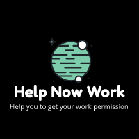
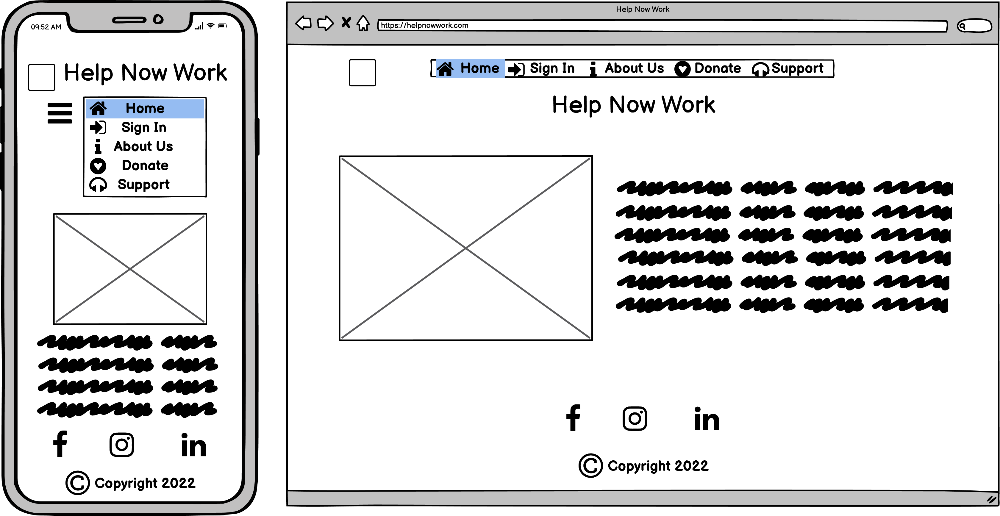
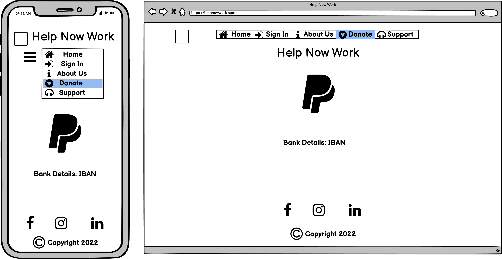
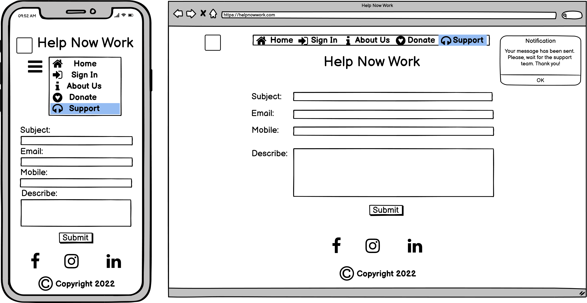
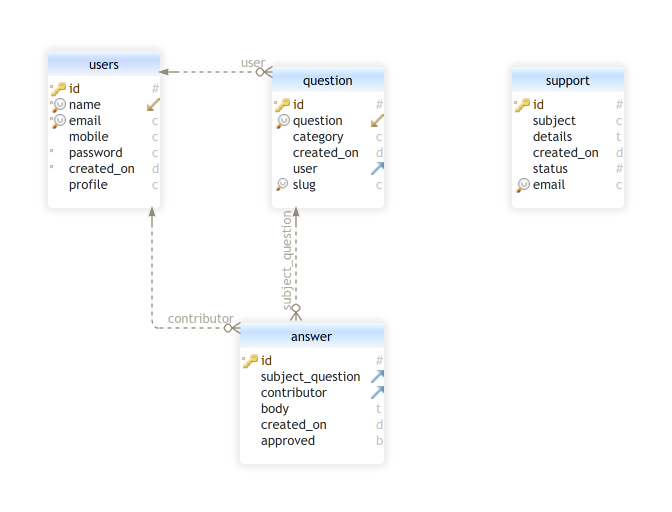

# Help Now Work




Many people are looking for a job in Ireland to move from their country with family to Ireland. But you need to do a lot of things and steps to get it:

- Find a company that provide sponsorship.
- Some companies ask to you apply for the visa.
- How you can do it? 
- How long is the process?
- Which documents and qualifications are required?

Many questions as above and others going on. Like me, I have tried to get these informations from Google or Government sites. 

Unfortunately, most of the time I didn't find enough information or correct information. 

This site HELP NOW WORK will help you with your questions. 

You input your question and other contributors that have passed for that or knew the answer can help you on your process. 

Welcome to Help Now Work!


[Click here to access the tool](https://helpnowwork.herokuapp.com//)

## User Experience (UX)
---

### Vision
    The idea for this tool is to provide an application that can help people with questions regarding immigration and work permission process.

### Aims
    To provide users an application they can go to when they want:

    - Creating a basic question and queries.
    - Receiving answers that are reviewed by the administrator.
    - And later you can become a contributor to help others.

### Target Audience
    People are looking for to move to Ireland with work permission:

    - All skills on critical skill professional list
    - All english students that want to stay in Ireland after english course
    - People wants to migrate to Ireland with their family

### User Stories (Agile Methodology)

1. Create account:
 - Anybody can create a new account with email and decide if become a User or Contributor.(Must-Have)

        Acceptance criteria:
        - Given That I have created 2 accounts, User and Contributor.
        - When I click on Sign In and Sign Up button.
        - Then I can confirm I have different levels of access depending on my profile. Different portal access.

2. Log a support case	
 - Anybody can log a support case to get technical help. (Could-Have)

        Acceptance criteria:
        - Given That I can create a support case.
        - When I click on the Support page in the home.
        - Then I can create a support case that generates a case to support the database where they can provide support.

3. Home and About Us
 - Anybody can navigate to the home page and read about us.	(Should-Have)

        Acceptance criteria:
        - Given That I can see the details regarding home and About us.
        - When I click on the Home and About us.
        - Then I can see a card that when I click there is a rotation to provide more details.

4. Donate Page	
 - Anybody can donate to the site with the donation details on Donate Page.	(Won't-Have)

        Acceptance criteria:
        - Given That I can see the details to provide a donation to the site.
        - When I click on Donate Page.
        - Then I can see details as IBAN to provide a donate to the site.

5. Send Questions	
 - As a User, I can send my questions to the Portal Contributor. (Must-Have)

        Acceptance Criteria:
        - Given That I can log as a User profile and create a question.
        - When I click to make a question in User Portal.
        - Then I can create a question for the website to contributor to provide an answer, I can edit and delete my question.

6. Search by Subject (User)	
 - As a User, I can search content by subject. (Could-Have)

        Acceptance Criteria:
        - Given That I can search questions by name and category.
        - When I click on all questions and there is a place to search.
        - Then I can search with part of a question or category and the site shows me the question-related.

7. Update profile (User)	
 - As a User, I can update my profile. (Must-Have)

        Acceptance Criteria:
        - Given That I can change my password, email address and remove my account.
        - When I click on change password or change email address in the right top after logged in.
        - Then I can change my password and some details regarding my account including remove.
 
8. Answer Questions	
 - As a Contributor, I can provide answers to the User questions.	(Must-Have)

        Acceptance Criteria:
        - Given That I can log as a Contributor profile and create answers to questions that I saw in the question list. I can edit my answers and remove them.
        - When I click on the question list and send answers for each question that I want.
        - Then I can send multiple answers to all questions created by the users.

9. Search by Subject (Contributor)	
 - As a Contributor, I can search content by subject.	(Could-Have)

        Acceptance Criteria:
        - Given That I can search questions by name and category.
        - When I click on all questions and there is a place to search.
        - Then I can search with part of a question or category and the site shows me the question-related.

10. Update profile (Contributor)	
 - As a Contributor, I can update my profile.	(Must-Have)

        Acceptance Criteria:
        - Given That I can change my password, email address and remove my account.
        - When I click on change password or change email address in the right top after logged in.
        - Then I can change my password and some details regarding my account including remove.


11. Review and Audit	
 - As an Administrator, I can review and audit the chat.	(Won't-Have)

        Acceptance Criteria:
        - Given That I can approved answer to the customer and delete accounts.
        - When I click in review answers or users list.
        - Then I can approve answer and edit answers or delete, and delete users.

12. Update profile (Administrator)	
 - As an Administrator, I can update my profile. (Must-Have)

        Acceptance Criteria:
        - Given That I can change my password, email address and remove my account.
        - When I click on change password or change email address in the right top after logged in.
        - Then I can change my password and some details regarding my account including remove.

### Site Map


### Design (WireFrame)

#### Home Page


#### About us Page


#### Donate Page


#### Support Page


#### Sign In Page


#### Sign Up Page


#### User Portal


#### Contributor Portal


#### Administrator Portal


#### Send Question Page


#### Send Answer Page


#### Search Question Page


#### User list Page


### Database

#### Model Diagram


## Features 

Here describes the main features of the website and what the user can expect when viewing ~

### Existing Features:

 - Create account
 - Log a support case
 - Home and About Us
 - Donate Page
 - Send Questions
 - Search Questions
 - Update profile
 - Answer Questions
 - Review Answers
 - Remove Users

### Future Features:

 - Library Database
 - Chat
 - Checklist Flying 
 - Upload content

## Technologies 
### **Dev Languages Used**
  
  - Python
  - Django
  - HTML
  - CSS
  - Javascript
  - PostgreSQL
  
### **Applications Used**
  
  - [GitPod](https://www.gitpod.io/) was used as an online IDE.
  - [GitHub](https://github.com/) is used to store the projects code and version control.
  - [Heroku](https://dashboard.heroku.com/) are used to deploy the site.
  - [Character Count](https://www.charactercountonline.com/older-versions/v2/) was used to add commit with max 50 characteres.
  - [W3Schools](https://www.w3schools.com/) was used to reference code for Python, HTML, JS and CSS.
  - [Balsamiq](https://balsamiq.com/) was used to create wireframe and sitemap.
  - [DBSchema](https://dbschema.com/) was used to create the relational database.
  - [Django Docs](https://docs.djangoproject.com/) was used to reference django documentation.
 
## Testing 

### Coverage Report


### Bug

 - No bugs.
 - I have some difficult some processes for validation and customize user.
 - I have some issues to put CSS working properly into the Heroku.

## Deployment 

Deploying the project using Heroku:
* Visit the [Heroku](https://dashboard.heroku.com/login) site and create an account
* Click the "New" Button
* Click the "Create new app" button
* Provide a name for the app in the App name input field
* Select your region from the choose region dropdown menu 
* Click the "Create App" button
* Once redirected, proceed to the settings tab
* Click on the "config vars" button
* Supply a KEY of `PORT` and it's value of `8000`. The click the "add" button
* Next step is to add Buildpacks, click the "Add Buildpack" button
* The `python` buildpack needs to be added first then the `nodejs` buildpack
* Once the buildpacks have completed, go to the deploy screen, once in the deploy screen, select GitHub as the deployment method and connect your GitHub profile
* Search for the repository that you wish to deploy to Heroku and click "connect"
* Once your repository is connected to Heroku you can choose to either manually or automatically deploy your app.
* By selecting automatic deploys, Heroku will build a new version of the app each time a change has been pushed to the repository
* Manual deploys allow you to build a new version of your app whenever you click manual deploy
* If your build is successful you will then be able to visit the live site by clicking the link that is provided to you by Heroku

Command to add packages to requirements.txt, `pip3 freeze --local > requirements.txt` 

### Making a Local Clone

1. Log in to GitHub and locate the [GitHub Repository](https://github.com/michaelrfreitas/p4_full_helpnowwork)
2. Under the repository name, click "Clone or download".
3. To clone the repository using HTTPS, under "Clone with HTTPS", copy the link.
4. Open Git Bash
5. Change the current working directory to the location where you want the cloned directory to be made.
6. Type `git clone`, and then paste the URL you copied in Step 3.

    $ `git clone https://github.com/michaelrfreitas/p4_full_helpnowwork` 

7. Press Enter. Your local clone will be created. 

```shell
$ git clone https://github.com/michaelrfreitas/p4_full_helpnowwork
> Cloning into `CI-Clone`...
> remote: Counting objects: 10, done.
> remote: Compressing objects: 100% (8/8), done.
> remove: Total 10 (delta 1), reused 10 (delta 1)
> Unpacking objects: 100% (10/10), done.
```

Alternatively, if using Gitpod, you can click below to create your own workspace using this repository.

You will need to also install all required packages in order to run this application on Heroku, refer to [requirements.txt](requirements.txt)
* Command to install this apps requirements is `pip3 install -r requirements.txt`

# Credits 
  ### **Images**
  The answer images were downloaded from:

  - [Critical Skills Employment Permits](https://enterprise.gov.ie/)

  ### **Code/Reference** 
  - [Django Docs](https://docs.djangoproject.com/) was used to reference django documentation.

  
  ### **Acknowledgment**
  I'd like to say thank you my mentor [Benjamin Kavanagh](https://github.com/BAK2K3) for his guidance and support throughout my project.

